# SSF Demo System Overview

This document provides a visual overview of the SSF (Shared Signals Framework) demo system with screenshots of each screen.

## Table of Contents

- [IdP Login Screen](#idp-login-screen)
- [IdP Portal (Admin Console)](#idp-portal-admin-console)
- [RP - OIDC Client (Push Delivery)](#rp---oidc-client-push-delivery)
- [RP2 - OIDC Client (Poll Delivery)](#rp2---oidc-client-poll-delivery)

---

## IdP Login Screen

### 01-idp-login.png
**IdP Login Screen**

The login screen for the IdP (Identity Provider). Users enter their username and password to authenticate.

When clicking "Login with OIDC" on RP/RP2, users are redirected to this screen via the OIDC authorization flow. After successful authentication, users are redirected back to RP/RP2 with an authorization code, completing the login. If an existing session exists at the IdP, this screen is skipped and users are directly redirected to RP/RP2 (Single Sign-On).


---

## IdP Portal (Admin Console)

### 02-idp-dashboard.png
**Dashboard Screen**

The main screen displayed after an administrator logs in. Shows a system overview including user count, OAuth client count, and SSF stream count. Quick action buttons provide direct access to various creation screens.

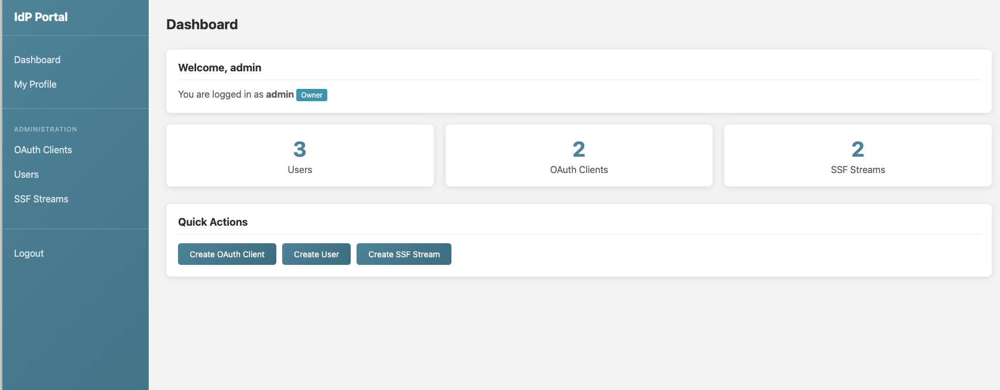

---

### 03-idp-oauth-clients.png
**OAuth Client List Screen**

Displays a list of registered OAuth clients (Relying Parties). Shows each client's ID, type (Confidential/Public), redirect URI, scopes, and creation date. Edit and delete operations are available.


---

### 04-idp-oauth-client-edit.png
**OAuth Client Edit Screen**

Detailed configuration screen for OAuth clients. The following items can be configured:
- Redirect URI
- Grant Types (Authorization Code, Refresh Token, Client Credentials)
- Response Types (Code, Token, ID Token)
- Scopes (openid, profile, email, offline_access, ssf:manage)
- Public Client flag
- Client secret regeneration
- Client deletion

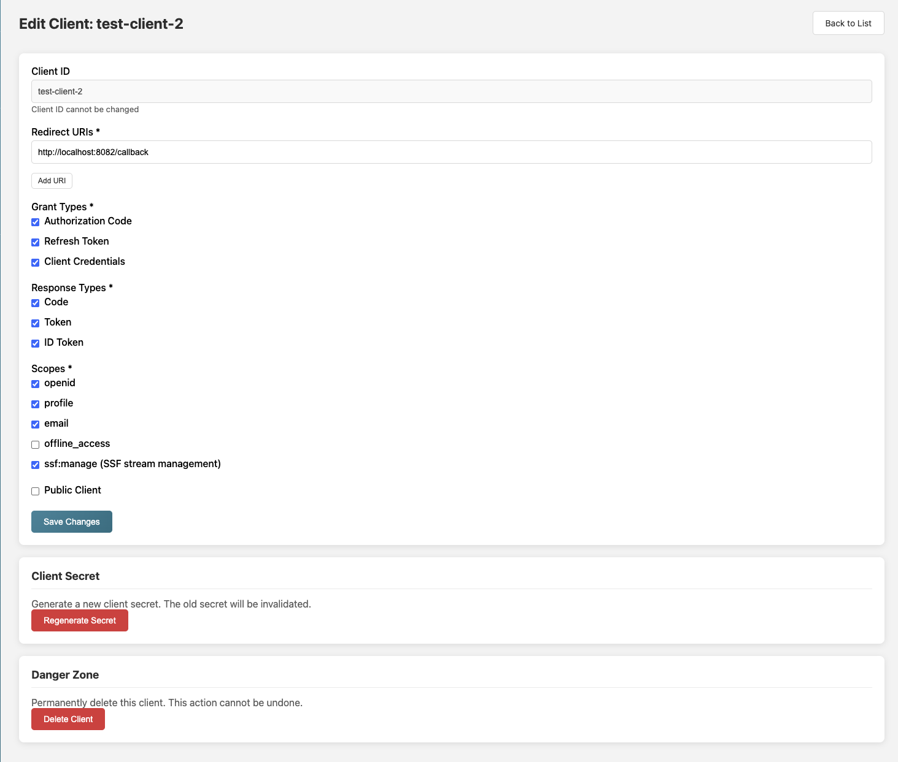

---

### 05-idp-users.png
**User List Screen**

Displays a list of users registered in the system. Shows username, email address, display name, role (Owner/Admin/User), status (Active/Inactive), and last login time. Includes search and filtering functionality.

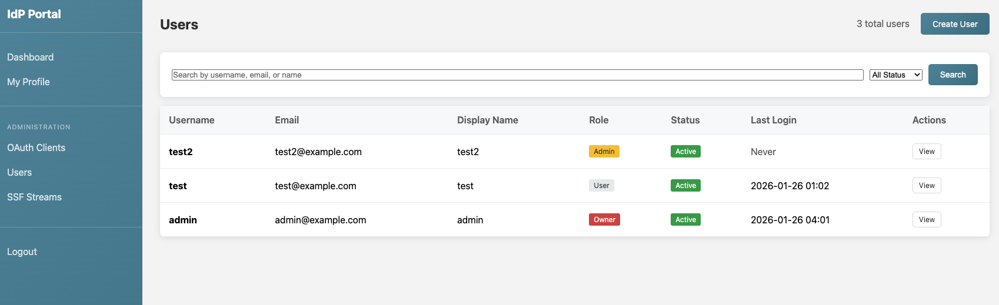

---

### 05b-idp-user-detail.png
**User Detail Screen**

Screen for administrators to view and edit user details. In addition to viewing user information (User ID, username, email, display name, role, status, creation date, last update, last login), the following operations are available:
- **Status Change**: Toggle between Active/Suspended (triggers account-disabled/account-enabled events)
- **Role Change**: Toggle between Owner/Admin/User (triggers token-claims-change events)

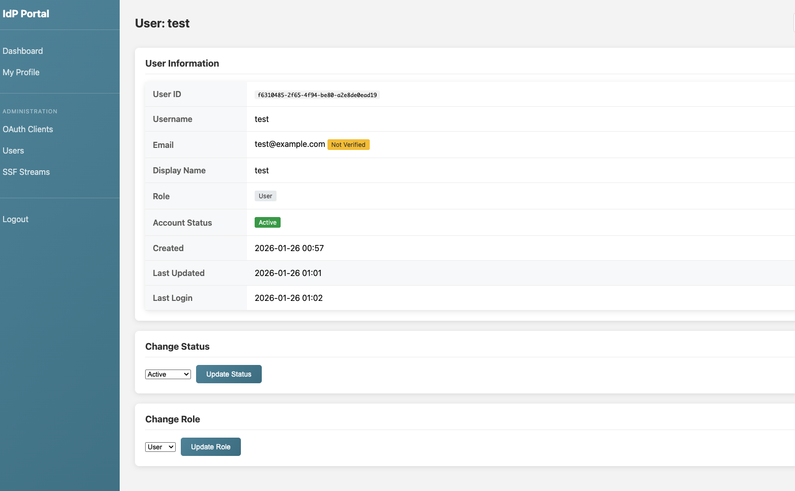

---

### 05c-idp-user-suspended.png
**User Detail Screen (Suspended State)**

The screen after an administrator changes a user's status to Suspended. Shows "User updated successfully!" message, and Account Status changes to Suspended (red). This operation triggers an account-disabled event, which invalidates sessions across all connected RPs.

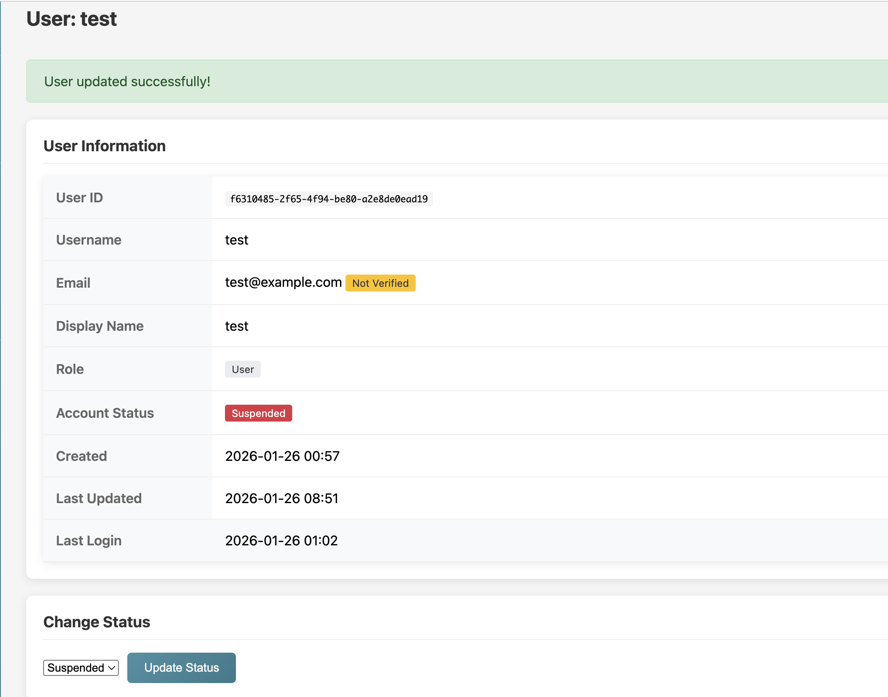

---

### 06-idp-my-profile.png
**My Profile Screen**

Screen to view and edit the logged-in user's own profile information. Allows viewing account information (username, email, role, status, registration date, last login) and changing display name.

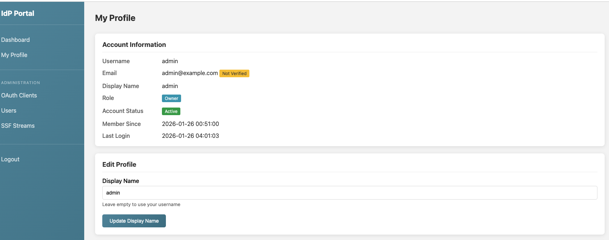

---

### 07-idp-login-history.png
**Login History Screen**

Screen for managing user login history and active sessions. Displays IP address, browser/device information, and login time in a list. Provides functionality to invalidate individual sessions or log out all sessions at once (Single Logout).

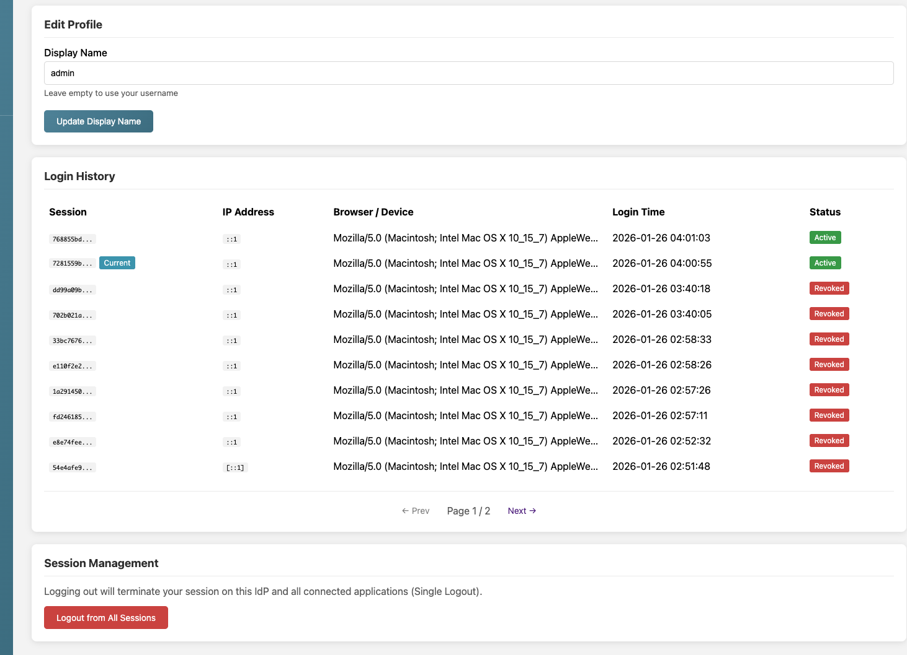

---

### 08-idp-ssf-streams.png
**SSF Stream List Screen**

Displays a list of SSF (Shared Signals Framework) streams. Shows each stream's description, endpoint, status (enabled/paused/disabled), event type count, sent event count, and creation date. Also displays the SSF Configuration URL.

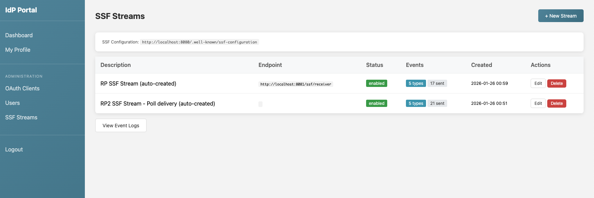

---

### 09-idp-ssf-stream-create.png
**SSF Stream Creation Screen**

Screen for creating a new SSF stream. Configure the following items:
- Description
- Delivery Method (Push/Poll)
- Receiver Endpoint URL (for Push delivery)
- Event types to deliver:
  - Session Revoked
  - Credential Change
  - Token Claims Change
  - Assurance Level Change
  - Device Compliance
  - Account Disabled/Enabled/Purged
  - Identifier Changed
  - Credential Compromise

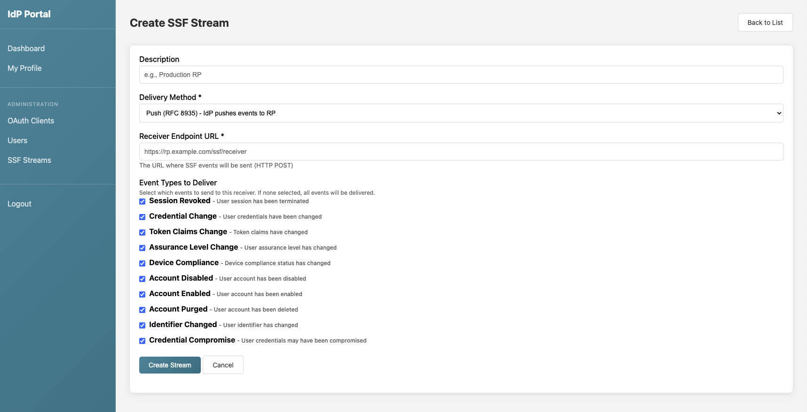

---

### 10-idp-ssf-stream-edit.png
**SSF Stream Edit Screen**

Screen for modifying existing SSF stream settings. Allows changing stream status (enabled/paused/disabled), event types to deliver, and other configuration updates.

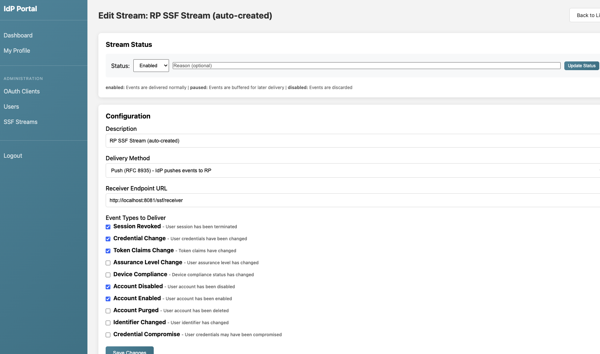

---

### 11-idp-ssf-stream-details.png
**SSF Stream Details Screen**

Detailed information and operations screen for SSF streams. Provides the following features:
- **Send Test Event**: Send a test event with specified event type and subject
- **Verify**: Verify stream connection
- **Recent Events List**: Display sent events with subject, status, creation time, and delivery time
- **Stream Details**: Display Stream ID, creation date, update date, and Delivery Method
- **Danger Zone**: Delete the stream

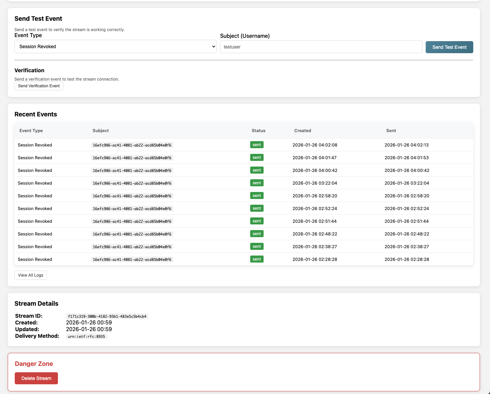

---

### 12-idp-ssf-event-logs.png
**SSF Event Logs Screen**

Centralized screen for managing event delivery history across all SSF streams. Displays statistics (total events, delivered, pending, failed) in dashboard format. Shows each event's type, subject, status, retry count, creation time, delivery time, and error information in a list. Filterable by stream, status, and event type.

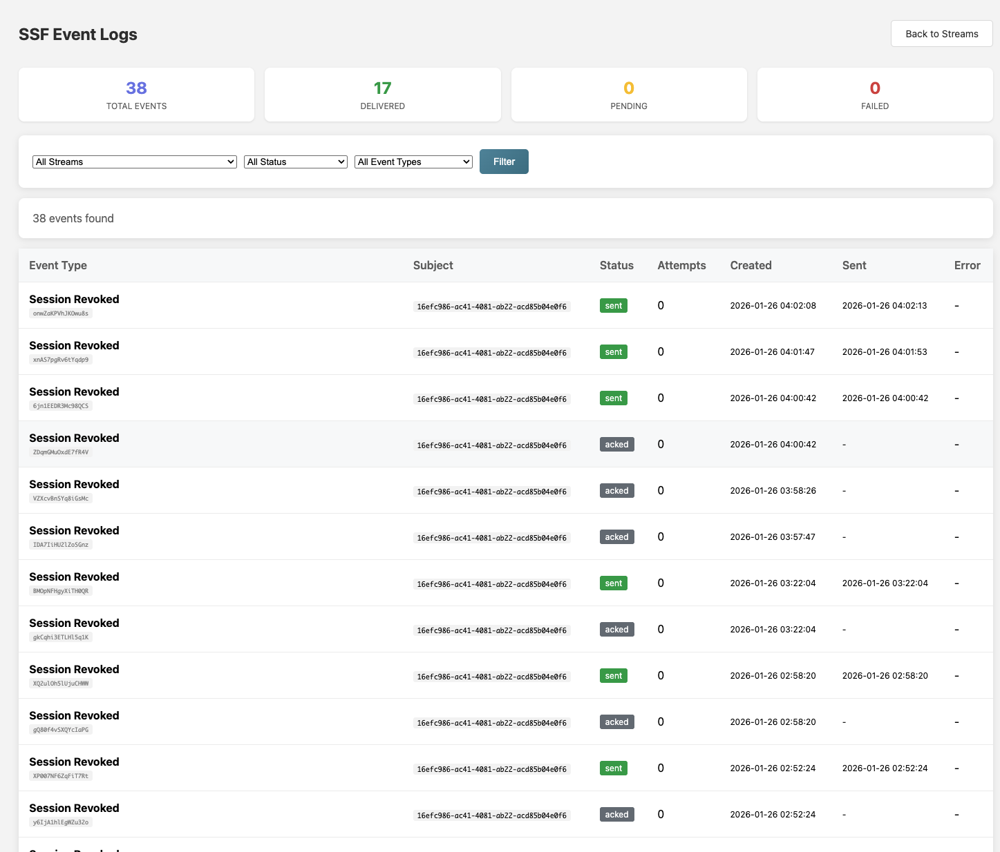

---

## RP - OIDC Client (Push Delivery)

RP (Relying Party) is an OIDC client using SSF Push delivery. Security events (SETs) are pushed in real-time from the IdP.

### 21-rp-home-not-logged-in.png
**RP Home Screen (Not Logged In)**

RP home screen in logged-out state. Clicking "Login with OIDC" redirects to the IdP's authorization endpoint, initiating the OIDC authorization code flow. If no session exists at the IdP, the login screen is displayed; if a session exists, users are directly redirected to RP and login completes.

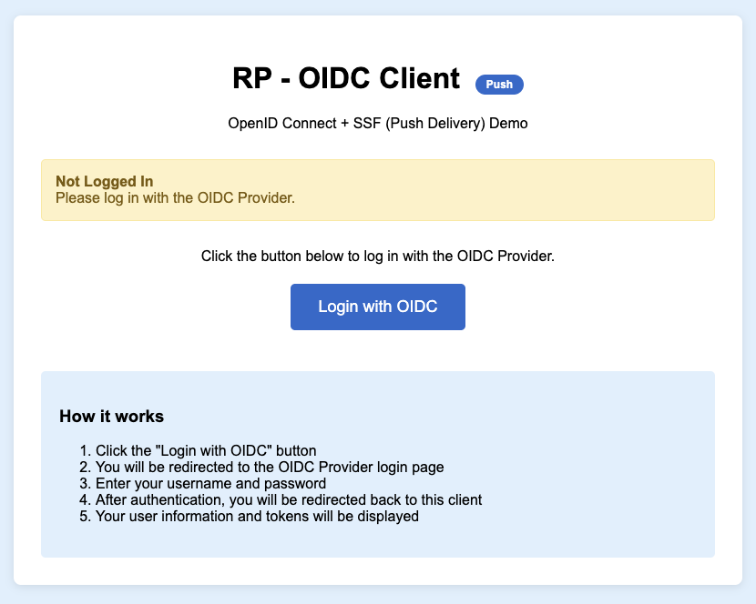

---

### 22-rp-home-logged-in.png
**RP Home Screen (Logged In)**

RP home screen after login. Displays user information (username, email, User ID, role). Clearly indicates that SSF Delivery method is Push (RFC 8935), and explains that role changes or session invalidation at the IdP are reflected in real-time.

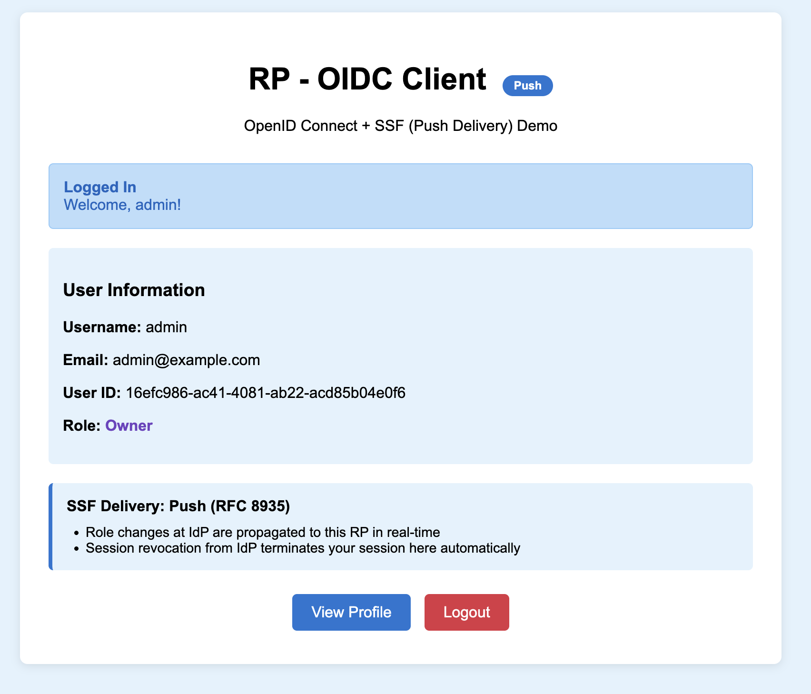

---

### 23-rp-profile.png
**RP User Profile Screen**

Screen displaying detailed user information. Shows User Information (ID, name, email), Role Information (current role), and Token Information (session creation date, expiration). Also notes that roles are included in the ID Token issued by the IdP and updated in real-time via SSF.

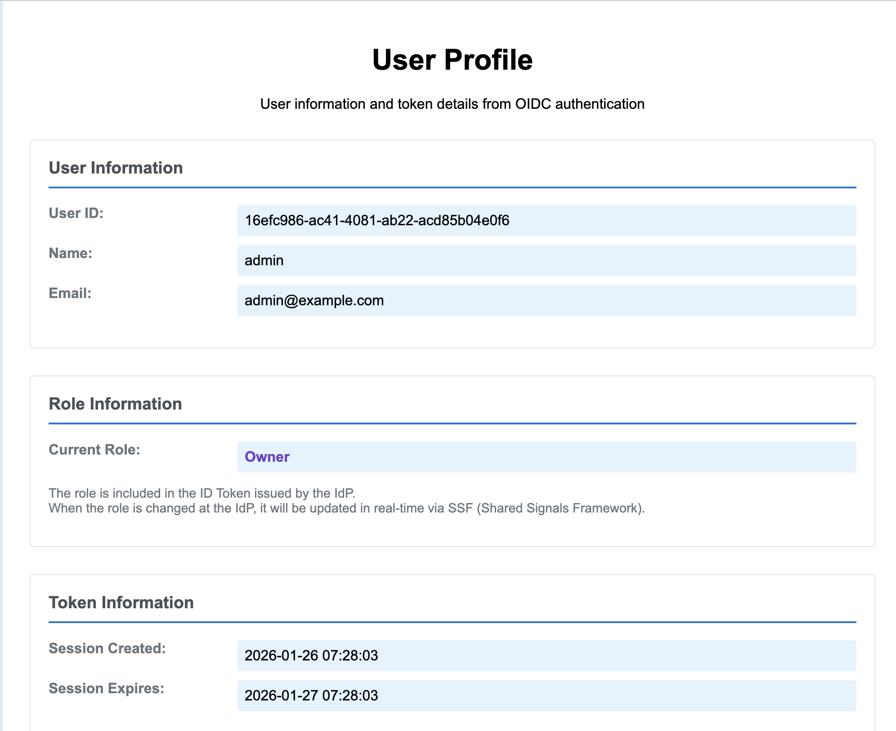

---

## RP2 - OIDC Client (Poll Delivery)

RP2 is an OIDC client using SSF Poll delivery. RP2 periodically polls the IdP to retrieve security events (SETs).

### 24-rp2-home-not-logged-in.png
**RP2 Home Screen (Not Logged In)**

RP2 home screen in logged-out state. Like RP, clicking "Login with OIDC" redirects to the IdP, initiating the OIDC authorization code flow. If an existing session exists at the IdP, the login screen is skipped and users are directly redirected to RP2. Green color scheme visually distinguishes it from the Push delivery RP.

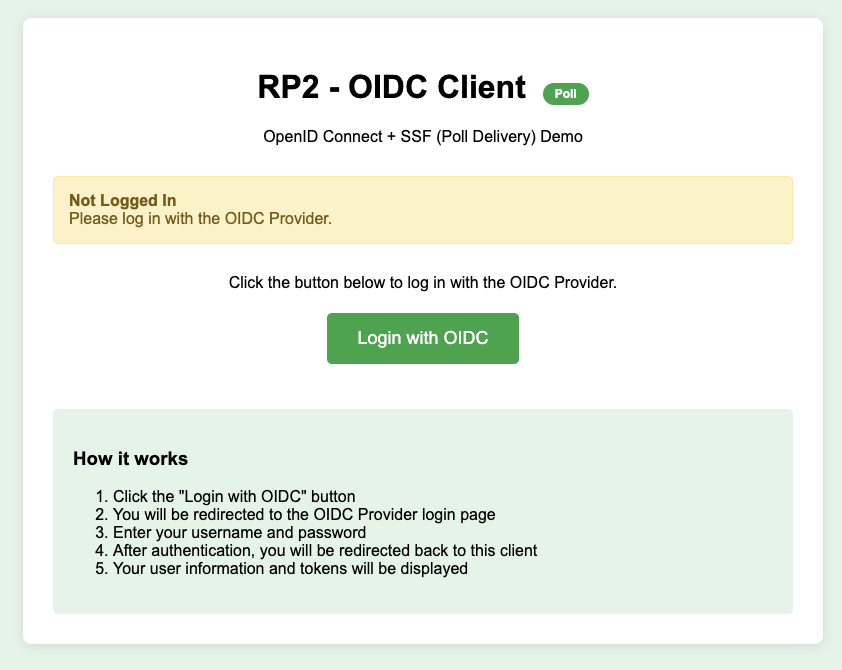

---

### 25-rp2-home-logged-in.png
**RP2 Home Screen (Logged In)**

RP2 home screen after login. Displays user information and clearly indicates that SSF Delivery method is Poll (RFC 8936). Explains that changes at the IdP are reflected through polling.


---

### 26-rp2-profile.png
**RP2 User Profile Screen**

RP2 user profile screen. Displays the same information as RP (User Information, Role Information, Token Information). Green color scheme visually indicates the Poll delivery method.

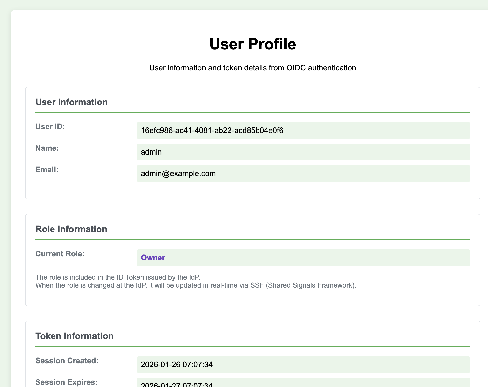

---

## System Architecture

The system consists of three main components:

| Component | Port | Role |
|-----------|------|------|
| **IdP** | 8080 | OIDC Provider + SSF Transmitter |
| **RP** | 8081 | OIDC Client + SSF Receiver (Push) |
| **RP2** | 8082 | OIDC Client + SSF Receiver (Poll) |

### SSF Event Flow

```
┌─────────────────────────────────────────────────────────────────┐
│                         IdP (Port 8080)                         │
│                                                                 │
│  ┌─────────────┐    ┌─────────────┐    ┌─────────────────────┐  │
│  │    OIDC     │    │   User      │    │   SSF Transmitter   │  │
│  │  Provider   │    │ Management  │    │                     │  │
│  └─────────────┘    └─────────────┘    └─────────────────────┘  │
│                            │                    │               │
│                            │ (user status       │               │
│                            │  change, etc.)     │               │
│                            └────────────────────┘               │
│                                     │                           │
└─────────────────────────────────────│───────────────────────────┘
                                      │
              ┌───────────────────────┼───────────────────────┐
              │                       │                       │
              ▼ Push (RFC 8935)       │                       ▼ Poll (RFC 8936)
┌─────────────────────────┐           │         ┌─────────────────────────┐
│    RP (Port 8081)       │           │         │    RP2 (Port 8082)      │
│                         │           │         │                         │
│  ┌─────────────────┐    │           │         │    ┌─────────────────┐  │
│  │  SSF Receiver   │◄───┼───────────┘         │    │  SSF Poller     │──┼───► Poll IdP
│  │  (endpoint)     │    │                     │    │  (background)   │  │
│  └─────────────────┘    │                     │    └─────────────────┘  │
│                         │                     │                         │
│  ┌─────────────────┐    │                     │    ┌─────────────────┐  │
│  │  Session Store  │    │                     │    │  Session Store  │  │
│  │  (invalidate)   │    │                     │    │  (invalidate)   │  │
│  └─────────────────┘    │                     │    └─────────────────┘  │
└─────────────────────────┘                     └─────────────────────────┘
```

### Supported SSF Event Types

| Event Type | Description |
|------------|-------------|
| `session-revoked` | Session invalidation |
| `token-claims-change` | Token claims updated (e.g., role change) |
| `credential-change` | Credential changed |
| `account-disabled` | Account suspended |
| `account-enabled` | Account re-enabled |
| `account-purged` | Account deleted |

When these events occur at the IdP, they are propagated to connected RPs via SSF, enabling immediate session invalidation or claim updates.
