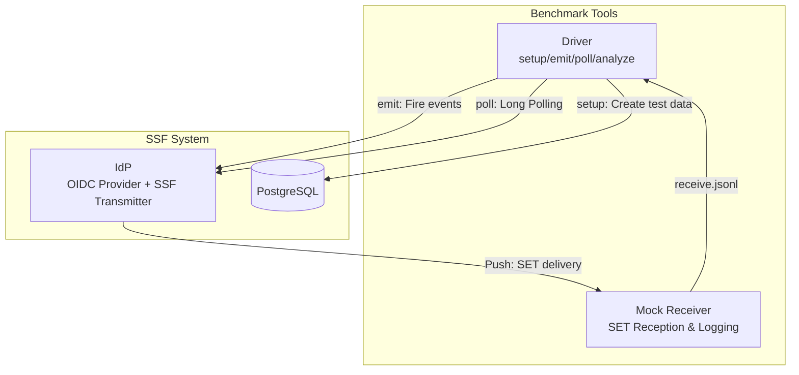
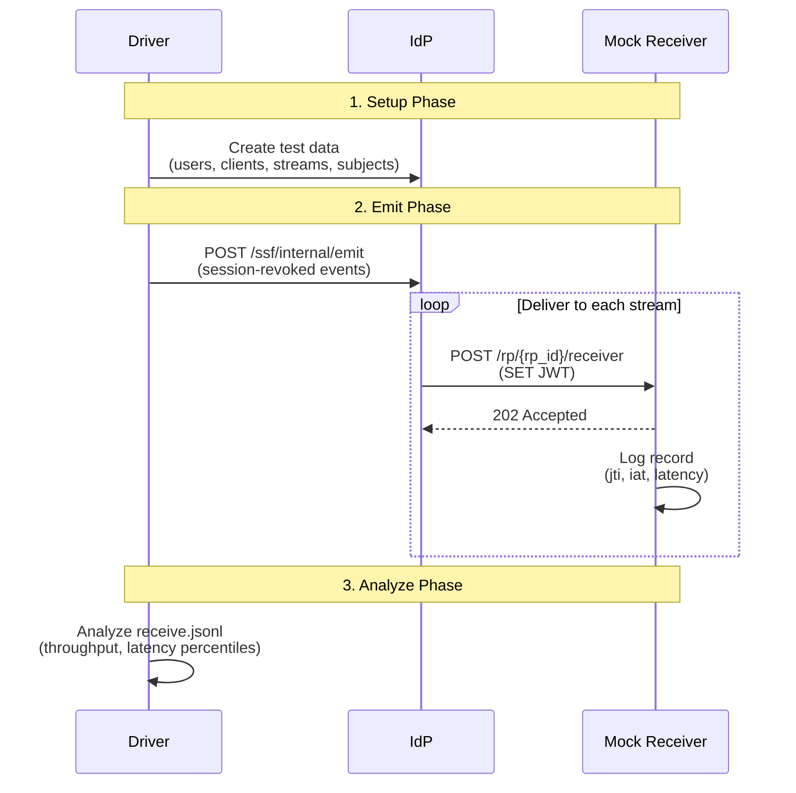
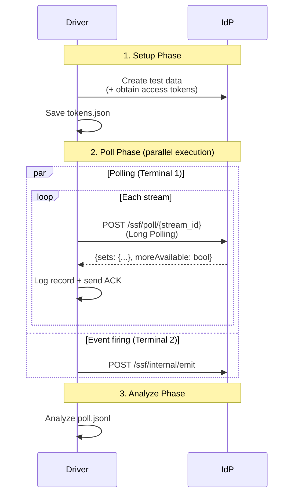
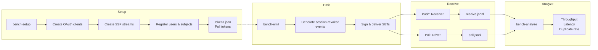
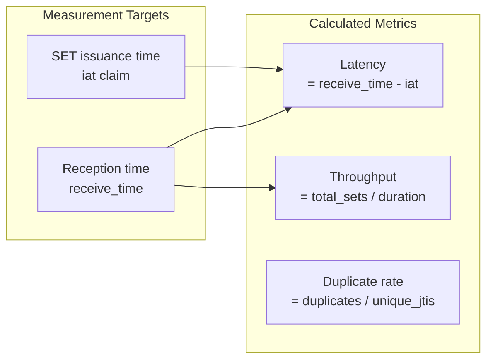
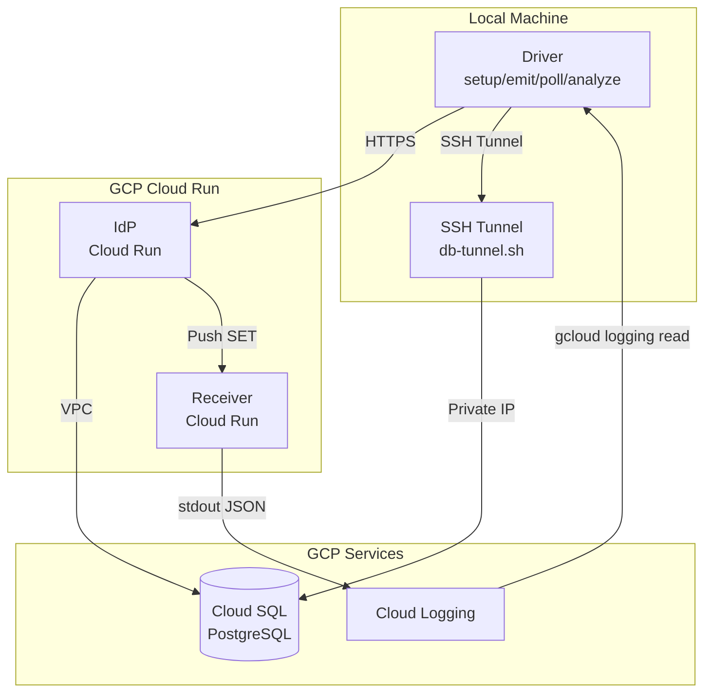

# SSF Benchmark

Benchmark tools for evaluating the scalability of the SSF implementation.

## Architecture

### Component Structure



### Components

| Component | Role |
|-----------|------|
| **Driver** | Test data generation, event firing, Poll client, result analysis |
| **Mock Receiver** | Simulates all RPs and records reception logs (for Push) |
| **IdP** | Delivers SETs as SSF Transmitter |

## Delivery Modes

SSF supports two delivery modes.

### Push Mode

IdP delivers directly to RP when an event occurs.



### Poll Mode

RP periodically polls IdP to retrieve events.



## Data Flow



## Quick Start (Local)

### 1. Build

```bash
make bench-build
```

### 2. Start Environment

```bash
# PostgreSQL + IdP
make db-start
make db-migrate-apply
make run-idp
```

## Push Delivery Measurement

Deliver events from IdP to RP (IdP → RP).

### 1. Start Mock Receiver (Terminal 1)

```bash
make bench-receiver
```

### 2. Create Test Data (Terminal 2)

```bash
# Small scale: 5 RPs × 100 users = 500 SETs
make bench-setup RPS=5 USERS=100 MODE=push
```

The following are automatically created during setup:
- OAuth clients (one per RP)
- SSF streams (with client_id configured)
- Users and subject registrations

### 3. Fire Events

```bash
make bench-emit CONCURRENCY=10
```

### 4. Analyze Results

After stopping the Receiver with Ctrl+C:

```bash
make bench-analyze
```

## Poll Delivery Measurement

RP polls IdP to retrieve events (RP → IdP).

### 1. Create Test Data (Terminal 1)

```bash
make bench-setup RPS=5 USERS=100 MODE=poll
```

The following are automatically created during setup:
- OAuth clients (one per RP)
- SSF streams (with client_id configured, Poll delivery)
- Access tokens (saved to `benchmark/results/tokens.json`)

### 2. Start Poll Client (Terminal 1)

```bash
# Start Long Polling (wait for 120 seconds)
make bench-poll POLL_TIMEOUT=120s
```

Tokens for each stream are automatically loaded from tokens.json.

### 3. Fire Events (Terminal 2)

```bash
make bench-emit CONCURRENCY=10
```

### 4. Analyze Results

After Poll Client times out or is stopped with Ctrl+C:

```bash
bin/driver analyze -log benchmark/results/poll.jsonl
```

## Operational Profiles

| Profile | RP Count | User Count | Total SETs |
|---------|----------|------------|------------|
| Small | 5 | 100 | 500 |
| Medium | 20 | 1,000 | 20,000 |
| Large | 50 | 10,000 | 500,000 |

Example: Medium-scale test
```bash
make bench-setup RPS=20 USERS=1000 MODE=push
```

## Result Files

| File | Description |
|------|-------------|
| `benchmark/results/receive.jsonl` | Push reception log |
| `benchmark/results/poll.jsonl` | Poll reception log |
| `benchmark/results/tokens.json` | Access tokens per stream |

Each line format:
```json
{"jti": "...", "rp_id": "...", "receive_time_us": ..., "iat_time_us": ..., "latency_us": ...}
```

## Metrics



- **Throughput**: SETs/sec (calculated from time to complete all SET deliveries)
- **Latency**: P50/P95/P99 (difference from SET's `iat` to reception time)
- **Duplicate rate**: Number of duplicate receptions with the same JTI

Example output:
```
=== Benchmark Results ===
Total Received:    500 SETs
Unique JTIs:       500
Unique RPs:        5

Latency (ms):
  Min:    1.23
  P50:    25.45
  P95:    125.67
  P99:    289.01
  Max:    412.34
  Mean:   45.67

Duration:          8234.56 ms
Throughput:        60.71 SETs/sec
```

## Cleanup

```bash
make bench-clean
```

## Makefile Targets

| Target | Description |
|--------|-------------|
| `bench-build` | Build benchmark tools |
| `bench-receiver` | Start Mock SET Receiver (for Push) |
| `bench-setup` | Create test data |
| `bench-emit` | Fire events |
| `bench-poll` | Start Poll benchmark |
| `bench-analyze` | Analyze Push results |
| `bench-clean` | Delete test data and logs |

## Variables

| Variable | Default | Description |
|----------|---------|-------------|
| `RPS` | 5 | Number of RPs (streams) |
| `USERS` | 100 | Number of users |
| `MODE` | push | Delivery mode (push/poll) |
| `CONCURRENCY` | 10 | Concurrency level |
| `POLL_TIMEOUT` | 60s | Poll timeout |
| `RECEIVER_URL` | http://localhost:9090 | Mock Receiver URL |
| `IDP_URL` | http://localhost:8080 | IdP URL |

## Cloud Benchmark (GCP Cloud Run)

Instructions for running benchmarks in a cloud environment.

### Cloud Architecture



### Prerequisites

- Infrastructure deployed with Terraform
- Logged in with `gcloud` CLI
- bench-receiver image pushed to Artifact Registry

### Push Mode

```bash
# Terminal 1: Start DB tunnel
./scripts/db-tunnel.sh

# Terminal 2: Run benchmark
make bench-cloud-setup RPS=5 USERS=100 MODE=push
make bench-cloud-emit CONCURRENCY=10

# Wait a few seconds then download logs
make bench-cloud-logs LOGS_SINCE=10m
make bench-analyze
```

### Poll Mode

```bash
# Terminal 1: Start DB tunnel
./scripts/db-tunnel.sh

# Terminal 2: Setup + start polling
make bench-cloud-setup RPS=5 USERS=100 MODE=poll
make bench-cloud-poll POLL_TIMEOUT=120s

# Terminal 3: Fire events
make bench-cloud-emit CONCURRENCY=10

# After polling completes, analyze
bin/driver analyze -log benchmark/results/poll.jsonl
```

### Environment Variables

| Variable | Description |
|----------|-------------|
| `CLOUD_IDP_URL` | Cloud IdP URL (auto-detected) |
| `CLOUD_RECEIVER_URL` | Cloud Receiver URL (auto-detected) |
| `GCP_PROJECT_ID` | GCP project ID (default: shared-signals) |
| `LOGS_SINCE` | Log retrieval period (default: 1h) |
