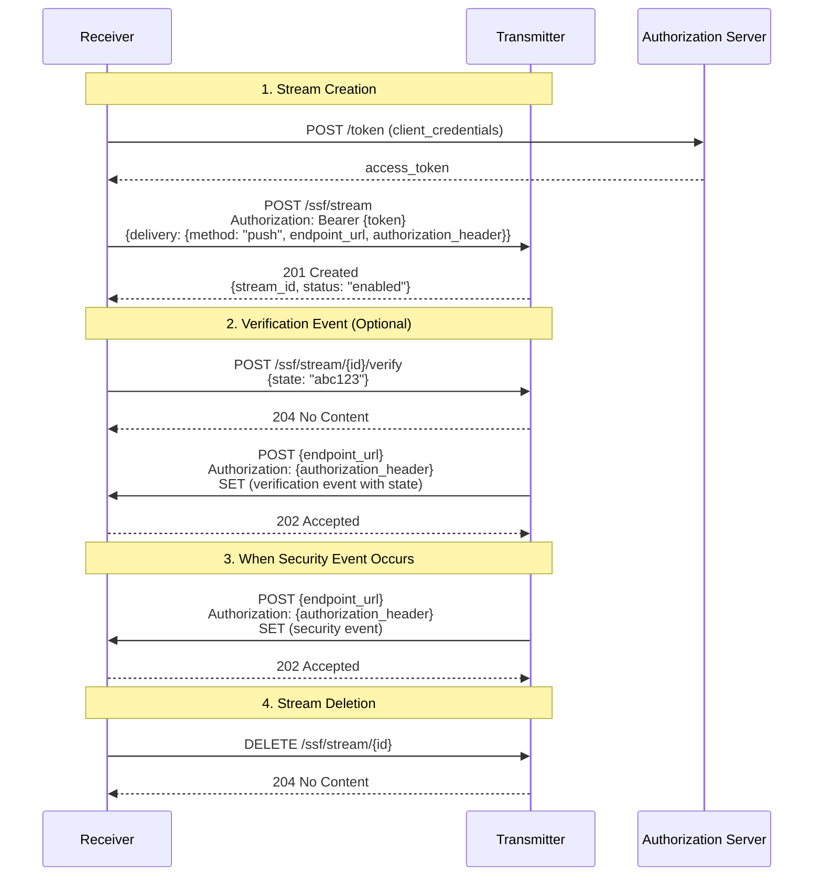
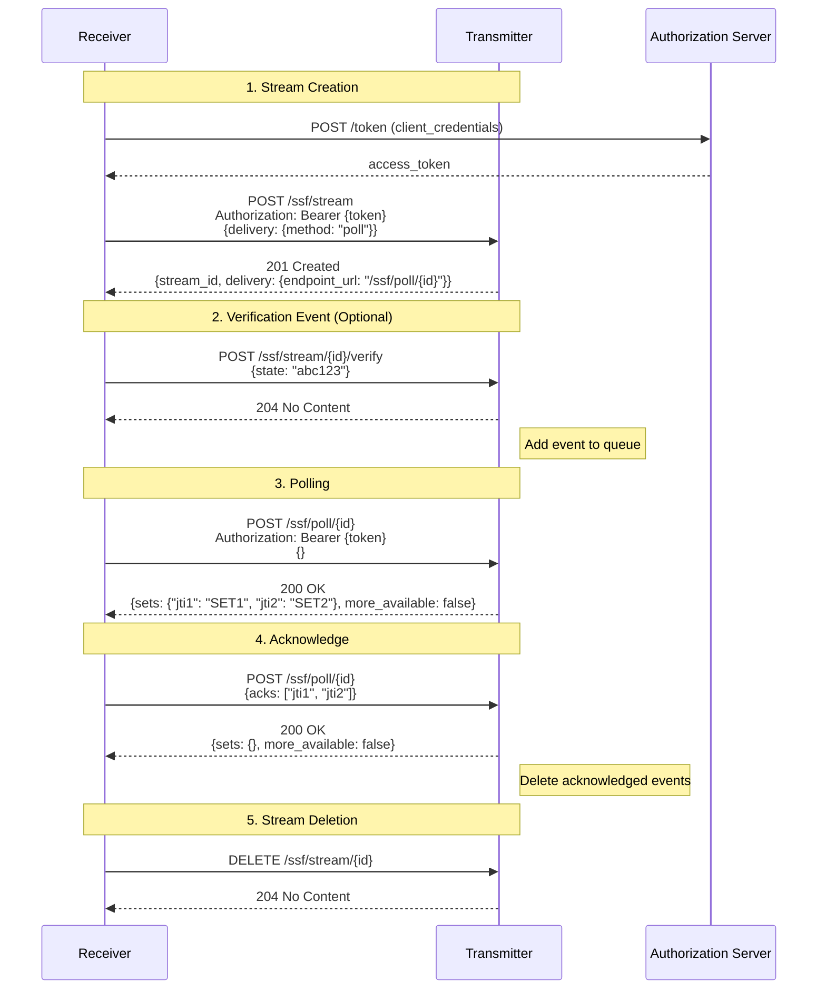
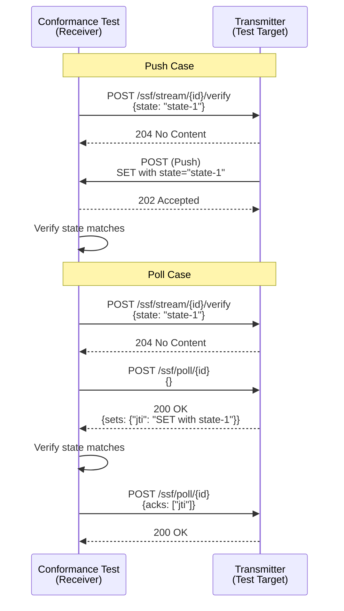

# OpenID SSF Transmitter Conformance Test Logs

This directory contains logs from the OpenID Foundation's SSF (Shared Signals Framework) Transmitter Conformance Tests.

## Test Overview

| Item | Value |
|------|-------|
| Test Plan | `openid-ssf-transmitter-test-plan` |
| Certification Profile | OpenID SSF Transmitter 1.0 |
| Test Suite Version | 5.1.39 |
| Target Issuer | `https://ssf-oidc-provider-dev-346948647218.asia-northeast1.run.app/` |
| SSF Profile | `caep_interop` |
| SSF Server metadata location | `discovery` |
| Client Authentication Method | `client_secret_basic` |
| Client Registration Method | `static_client` |

### Test Configuration Details

#### SSF Profile: `caep_interop`

The CAEP (Continuous Access Evaluation Profile) Interoperability profile is used to verify interoperability between SSF implementations.

#### SSF Server metadata location: `discovery`

The SSF Transmitter metadata is automatically retrieved from `/.well-known/ssf-configuration`.

---

## Test Results Summary

### Push Delivery (RFC 8935) - All 18 Tests PASSED

| Test | Result |
|------|--------|
| openid-ssf-transmitter-metadata | PASSED |
| openid-ssf-stream-control-happy-path | PASSED |
| openid-ssf-stream-control-error-create-stream-with-broken-input | PASSED |
| openid-ssf-stream-control-error-create-stream-with-invalid-token | PASSED |
| openid-ssf-stream-control-error-create-stream-with-duplicate-config | PASSED |
| openid-ssf-stream-control-error-read-stream-with-invalid-token | PASSED |
| openid-ssf-stream-control-error-read-unknown-stream | PASSED |
| openid-ssf-stream-control-error-update-stream-with-invalid-token | PASSED |
| openid-ssf-stream-control-error-update-stream-with-invalid-body | PASSED |
| openid-ssf-stream-control-error-update-unknown-stream | PASSED |
| openid-ssf-stream-control-error-replace-stream-with-invalid-token | PASSED |
| openid-ssf-stream-control-error-replace-stream-with-invalid-body | PASSED |
| openid-ssf-stream-control-error-replace-unknown-stream | PASSED |
| openid-ssf-stream-control-error-delete-stream-with-invalid-token | PASSED |
| openid-ssf-stream-control-error-delete-unknown-stream | PASSED |
| openid-ssf-stream-subject-control | PASSED |
| openid-ssf-transmitter-events | PASSED |
| openid-ssf-transmitter-push-no-auth | PASSED |

### Poll Delivery (RFC 8936) - All 17 Tests PASSED

| Test | Result |
|------|--------|
| openid-ssf-transmitter-metadata | PASSED |
| openid-ssf-stream-control-happy-path | PASSED |
| openid-ssf-stream-control-error-create-stream-with-broken-input | PASSED |
| openid-ssf-stream-control-error-create-stream-with-invalid-token | PASSED |
| openid-ssf-stream-control-error-create-stream-with-duplicate-config | PASSED |
| openid-ssf-stream-control-error-read-stream-with-invalid-token | PASSED |
| openid-ssf-stream-control-error-read-unknown-stream | PASSED |
| openid-ssf-stream-control-error-update-stream-with-invalid-token | PASSED |
| openid-ssf-stream-control-error-update-stream-with-invalid-body | PASSED |
| openid-ssf-stream-control-error-update-unknown-stream | PASSED |
| openid-ssf-stream-control-error-replace-stream-with-invalid-token | PASSED |
| openid-ssf-stream-control-error-replace-stream-with-invalid-body | PASSED |
| openid-ssf-stream-control-error-replace-unknown-stream | PASSED |
| openid-ssf-stream-control-error-delete-stream-with-invalid-token | PASSED |
| openid-ssf-stream-control-error-delete-unknown-stream | PASSED |
| openid-ssf-stream-subject-control | PASSED |
| openid-ssf-transmitter-events | PASSED |

> **Note:** The `openid-ssf-transmitter-push-no-auth` test is not executed for Poll delivery (it is a Push-specific test).

---

## Test Execution Information

### Push Delivery (RFC 8935)

- **Directory:** `ssf-transmitter-push-based-test-logs/`
- **Delivery Method:** `push` (urn:ietf:rfc:8935)
- **Test Date:** 2026-01-25T19:17:17Z
- **Plan ID:** `x49SsWzl1Uc1g`

### Poll Delivery (RFC 8936)

- **Directory:** `ssf-transmitter-poll-based-test-logs/`
- **Delivery Method:** `poll` (urn:ietf:rfc:8936)
- **Test Date:** 2026-01-25T19:21:24Z
- **Plan ID:** `9qye64W4FoHKk`

---

## Delivery Method Details

SSF supports two methods for delivering Security Event Tokens (SETs): **Push** and **Poll**.

### Push Delivery (RFC 8935)

A method where the Transmitter actively sends SETs to the Receiver's endpoint when an event occurs.

**Characteristics:**
- High real-time capability (delivered immediately after event occurrence)
- Receiver requires a constantly listening endpoint
- Transmitter maintains the Receiver's `endpoint_url` and `authorization_header`
- Retry on delivery failure is the Transmitter's responsibility

**Example Stream Creation Request:**
```json
{
  "delivery": {
    "method": "urn:ietf:rfc:8935",
    "endpoint_url": "https://receiver.example.com/ssf/events",
    "authorization_header": "Bearer secret-token"
  },
  "events_requested": [
    "https://schemas.openid.net/secevent/ssf/event-type/verification"
  ]
}
```

### Poll Delivery (RFC 8936)

A method where the Receiver periodically polls the Transmitter's endpoint to retrieve SETs.

**Characteristics:**
- Usable even within firewalls since the Receiver actively retrieves events
- Receiver does not need a public endpoint
- Events are queued at the Transmitter and retained until the Receiver acknowledges them
- Delay occurs depending on polling interval

**Example Stream Creation Request:**
```json
{
  "delivery": {
    "method": "urn:ietf:rfc:8936"
  },
  "events_requested": [
    "https://schemas.openid.net/secevent/ssf/event-type/verification"
  ]
}
```

**Example Stream Creation Response:**
```json
{
  "stream_id": "f67e39a0-...",
  "delivery": {
    "method": "urn:ietf:rfc:8936",
    "endpoint_url": "https://transmitter.example.com/ssf/poll/f67e39a0-..."
  }
}
```

### Push vs Poll Comparison

| Item | Push (RFC 8935) | Poll (RFC 8936) |
|------|-----------------|-----------------|
| Delivery Trigger | Transmitter | Receiver |
| Real-time Capability | High | Depends on polling interval |
| Receiver Requirements | Public endpoint required | Not required |
| Firewall | May be difficult to pass through | No issues |
| Delivery Guarantee | Transmitter retries | Retained until Receiver ACKs |
| Scalability | Depends on event volume | Depends on polling frequency |

---

## Request Flow

### Push Delivery Sequence



### Poll Delivery Sequence



### Conformance Test Verification Flow

The conformance test verifies Verification event delivery with the following flow:



---

## Test Module Details

The conformance test verifies the following areas:

### 1. Transmitter Metadata (`openid-ssf-transmitter-metadata`)
Verifies that the `/.well-known/ssf-configuration` endpoint returns valid Transmitter metadata.

**Required Fields:**
- `issuer` - Transmitter identifier
- `jwks_uri` - Public key for signature verification
- `delivery_methods_supported` - Supported delivery methods
- `configuration_endpoint` - Stream management endpoint

### 2. Stream Control - Happy Path (`openid-ssf-stream-control-happy-path`)
Tests the stream lifecycle (create, read, update, replace, delete).

**Test Sequence:**
1. Retrieve Transmitter metadata
2. Verify TLS connection
3. Prepare Transmitter access (obtain token)
4. Clean up existing streams
5. Create → Read → Update → Replace → Check status → Delete stream

| Operation | Method | Endpoint | Expected Status |
|-----------|--------|----------|-----------------|
| Create | POST | `/ssf/stream` | 201 Created |
| Read | GET | `/ssf/stream/{id}` | 200 OK |
| Update | PATCH | `/ssf/stream/{id}` | 200 OK |
| Replace | PUT | `/ssf/stream/{id}` | 200 OK |
| Get Status | GET | `/ssf/stream/{id}/status` | 200 OK |
| Update Status | POST | `/ssf/stream/{id}/status` | 200 OK |
| Delete | DELETE | `/ssf/stream/{id}` | 204 No Content |

### 3. Stream Control - Error Cases
Tests error handling for various invalid operations:

| Test | Expected Status | Description |
|------|-----------------|-------------|
| `create-stream-with-broken-input` | 400 Bad Request | Invalid JSON |
| `create-stream-with-invalid-token` | 401 Unauthorized | Invalid token |
| `create-stream-with-duplicate-config` | 409 Conflict | Duplicate configuration |
| `read-stream-with-invalid-token` | 401 Unauthorized | Invalid token |
| `read-unknown-stream` | 404 Not Found | Non-existent stream |
| `update-stream-with-invalid-token` | 401 Unauthorized | Invalid token |
| `update-stream-with-invalid-body` | 400 Bad Request | Invalid request |
| `update-unknown-stream` | 404 Not Found | Non-existent stream |
| `replace-stream-with-invalid-token` | 401 Unauthorized | Invalid token |
| `replace-stream-with-invalid-body` | 400 Bad Request | Invalid request |
| `replace-unknown-stream` | 404 Not Found | Non-existent stream |
| `delete-stream-with-invalid-token` | 401 Unauthorized | Invalid token |
| `delete-unknown-stream` | 404 Not Found | Non-existent stream |

### 4. Subject Control (`openid-ssf-stream-subject-control`)
Tests adding and removing subjects from a stream.

| Operation | Method | Endpoint |
|-----------|--------|----------|
| Add | POST | `/ssf/stream/{id}/subjects:add` |
| Remove | POST | `/ssf/stream/{id}/subjects:remove` |

### 5. Event Transmission (`openid-ssf-transmitter-events`)
Tests Verification event transmission. The test sequence differs by delivery method.

**Common Steps:**
1. Create a stream with Verification event type
2. Trigger Verification event via `/ssf/stream/{id}/verify`
3. Verify that the SET's `state` claim matches
4. Verify the SET's signature using JWKS

**For Push Delivery:**
- Trigger one Verification event
- Confirm SET reception at the Push endpoint

**For Poll Delivery:**
- Trigger three Verification events and verify with different polling modes:
  1. **POLL_ONLY**: Retrieve events but do not acknowledge
  2. **ACKNOWLEDGE_ONLY**: Only acknowledge previously retrieved events
  3. **POLL_AND_ACKNOWLEDGE**: Retrieve and acknowledge simultaneously

### 6. Push Without Auth (`openid-ssf-transmitter-push-no-auth`) - Push Only
Tests Push delivery without `authorization_header`.

---

## File Structure

Each test generates the following files:
- `test-log-{test-name}-{id}.html` - Human-readable test log
- `test-log-{test-name}-{id}.json` - Machine-readable test log
- `*.sig` - Signature files for verification

Index files:
- `index.html` - Test plan summary (HTML)
- `index.json` - Test plan metadata (JSON)

---

## Related Specifications

- [OpenID Shared Signals Framework 1.0](https://openid.net/specs/openid-sharedsignals-framework-1_0.html)
- [RFC 8935 - Push-Based Security Event Token (SET) Delivery](https://datatracker.ietf.org/doc/html/rfc8935)
- [RFC 8936 - Poll-Based Security Event Token (SET) Delivery](https://datatracker.ietf.org/doc/html/rfc8936)
- [RFC 8417 - Security Event Token (SET)](https://datatracker.ietf.org/doc/html/rfc8417)
